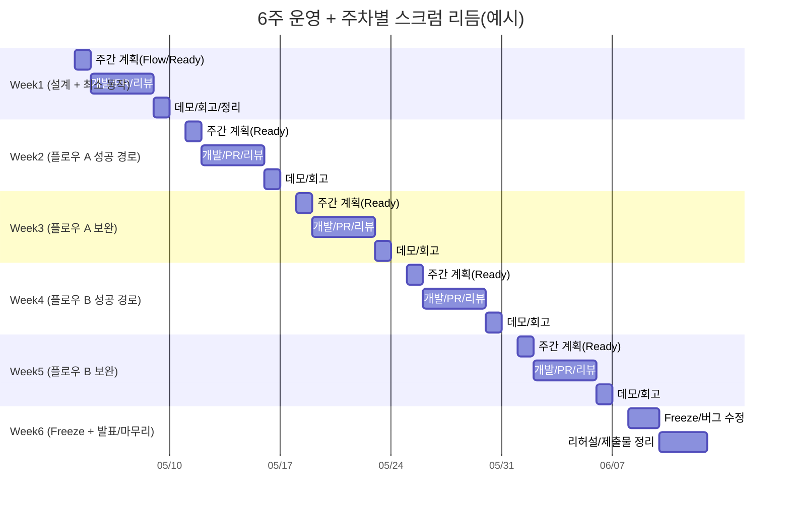

# 애자일 기반 팀 프로젝트 가이드

> 이 문서는 **수강생이 그대로 따라 할 수 있는 실행 가이드**입니다.  
> 세부 템플릿/클릭 가이드는 아래 문서를 참고하세요.
>
> - **Issue/PR/Notion 템플릿**: `02_애자일_문서화_템플릿.md`
> - **Product Brief·Backlog·Tech Spec·회고 전체 양식**: [`../06_프로젝트_산출물_템플릿.md`](../06_프로젝트_산출물_템플릿.md) (§3 Product Brief, §4 Backlog 등)
> - **Product Brief 샘플(복붙용)**: `example/01_product_brief.md`
> - **GitHub Projects 보드 세팅/자동화**: `03_애자일_GitHub_프로젝트_세팅.md`
> - **역할별 운영 방식**: `04_애자일_역할_배분_가이드.md`
>
> 운영 철학·스크럼반 정의는 과정 문서 **`05_프로젝트_운영_방식.md`** 와 `06`이 짝을 이룬다. 이 가이드는 **GitHub Issue 중심 실행 규칙**에 초점을 둔다.

---

## 0. TL;DR (이 8줄만 지켜도 굴러갑니다)

1. **Product Brief(최소 1장)** 로 문제·MVP·성공 기준을 합의한다. (Notion)
2. **Flow(사용자 목표 흐름)** 를 만든다. (Notion)
3. Flow를 **개발 가능한 Issue**로 쪼갠다. (GitHub)
4. **완료 기준(AC)** 없으면 Ready 금지.
5. 작업은 **Issue → PR → Review → Merge** 순서로만 한다.
6. **Done = PR Merge + 완료 기준(AC) 충족**.
7. 매주 **데모 시나리오**로 실제 동작을 확인한다. (Notion)
8. Notion은 “설명용”, **실행(개발)은 GitHub만 보고 가능**해야 한다.

> 용어(빠른 정의)
> - **Product Brief**: 제품/프로젝트를 **한 장(짧게)** 으로 합의하는 문서. 문제·사용자·목표·MVP 범위·성공 기준 등(설명용, 보통 Notion). **실행 단위 분해·Done 판정**은 Issue+AC가 담당한다.
> - **Flow(User Flow)**: 사용자 목표 1개를 달성하는 시작→끝 흐름(‘지도’, 설명용은 Notion).
> - **Story/Issue**: Flow를 구현하기 위한 개발 작업 단위(이 문서 세트의 실행 기준(SSOT)).
> - **완료 기준(AC)**: Done 판정 체크리스트(관찰 가능/예-아니오). **완료 기준(AC) 없으면 Ready 금지**.
> - **Ready/Demo Scenario**: Ready=이번 주 착수 가능 상태(완료 기준(AC) 등 조건 충족), Demo Scenario=실제로 눌러 보여줄 실행 순서(점검 기준).
---

## 0-1. 확정 규칙(판정표) — 논쟁 금지

아래 항목은 팀 내 합의가 끝난 “규칙”입니다. **예외는 Decision Log에 남기고** 최소로만 허용합니다.

- **실행 기준(SSOT)**: GitHub **Issue**
- **디자인 기준(화면/스타일 원본)**: Figma(해당 Frame 링크)
- **Ready(이번 주 대상)**: 아래 3개를 모두 만족한 Issue만
  - 1) 완료 기준(AC)이 있다(3~7개 권장)
  - 2) Flow 링크가 있다
  - 3) 이번 주 주차(Iteration, Week)가 지정되어 있다
- **UI 포함 Issue의 Ready 조건(추가)**: 위 Ready 조건을 만족하면서, Issue에 **Design(Figma) 링크**가 있어야 한다(해당 Frame **바로가기 링크** 권장)
- **In Progress**: Assignee가 붙으면 작업 시작(동시에 1~2개만 권장)
- **Review**: PR이 열리고 Issue에 `Closes #123`로 연결되면 Review
- **Done(완료)**: **PR Merge + 완료 기준(AC) 충족** (드래그로 Done 금지)
- **리뷰 응답 시간(SLA, 권장)**: PR 올라오면 **24시간 내 1차 피드백**(승인/수정 요청/질문)
- **PR:Issue 권장**: 기본은 **1 PR = 1 Issue**. 단, 같은 Flow의 작은 Issue는 **1 PR에 묶을 수 있으며**, PR 본문에 `Closes #123`, `Closes #124`처럼 **모든 Issue를 명시적으로 연결**한다.
- **Empty 트리거**: “0개가 될 수 있는 목록/피드 화면”이 하나라도 있으면 **Empty는 필수 상태**
- **Freeze(Week 6)**: 기능 추가 중단, 안정화/QA/README/리허설 우선

> 용어(판정용)
> - **실행 기준(SSOT)**: 우리가 따라야 하는 기준 1곳. 여기서는 **GitHub Issue**.
> - **Done**: **PR Merge + 완료 기준(AC) 충족**(드래그로 Done 금지).
> - **주차(Iteration)/스프린트(Sprint)**: 1주 단위 실행 리듬/필드(Week1, Week2…). Ready에는 Week를 지정합니다.
> - **리뷰 응답 시간(SLA)**: PR 리뷰 응답 시간 기준(예: 24h 내 1차 피드백).
---

## 1. 목적

이 가이드는 **6주 동안 팀 프로젝트를 애자일 방식으로 완주**하기 위한 실행 방법을 제공합니다.

**최종 목표**
- **2~5분 내 실패 없이 실행 가능한 데모 완성**

---

## 2. 핵심 원칙 (반드시 지킬 것)

### 2-1. 작게 만들고 빠르게 검증한다
- 완벽보다 **동작**이 우선
- **Week 1부터 데모 가능**해야 한다

### 2-2. GitHub만 보면 개발 가능해야 한다
- 모든 작업은 **Issue** 기준
- 실행 기준(SSOT)은 GitHub에 있다

### 2-3. Notion은 “설명용”이다
- Brief / Flow / Demo / Decision / Retro만 작성
- 상세 명세를 길게 쓰지 않는다(문서 과다 금지)

### 2-4. PR 없으면 완료가 아니다
- 코드 작성 → **PR** → 리뷰 → 머지
- 이 흐름이 “완료”의 일부다

---

## 3. 최소 개념(실행에 필요한 만큼만)

- **애자일(Agile)**: 작게 만들고 → 빠르게 확인하고 → 반복 개선
- **Product Brief**: “무엇을/왜/누구를 위해/6주 안에 어디까지”를 팀이 같은 그림으로 보기 위한 **최소 제품 개요**(Notion 등). 상세 명세서가 아니다.
- **Flow(User Flow)**: 사용자가 **하나의 목표**를 달성하는 과정(시작~끝)
- **Story(Issue)**: Flow를 구현하기 위한 **개발 작업 단위**
- **완료 기준(AC, Acceptance Criteria)**: “끝났다”를 판단하는 **체크리스트**
- **Done**: **PR이 머지**되고 **AC를 만족**한 상태
- **실행 기준(SSOT)**: 우리가 따라야 하는 기준 1곳 — 이 문서에서는 **GitHub Issue**

---

## 4. 전체 진행 방식(6주 운영안)

```text
Week1: 설계 + 최소 동작(데모 1개)
Week2: 기능/플로우 A 성공 경로(처음부터 끝까지)
Week3: 기능/플로우 A 보완(로딩/에러/빈/예외)
Week4: 기능/플로우 B 성공 경로(처음부터 끝까지)
Week5: 기능/플로우 B 보완(로딩/에러/빈/예외) + (선택) 소규모 리팩터링
Week6: Freeze(기능 추가 중단) + 발표/마무리(QA/README/리허설)
```

### 4-1. 전체(6주) 시각화(요약)

```mermaid
flowchart LR
  W1[Week1<br/>설계 + 최소 동작(데모 1개)] --> W2[Week2<br/>플로우 A 성공 경로<br/>(처음부터 끝까지)]
  W2 --> W3[Week3<br/>플로우 A 보완<br/>(로딩/에러/빈/예외)]
  W3 --> W4[Week4<br/>플로우 B 성공 경로<br/>(처음부터 끝까지)]
  W4 --> W5[Week5<br/>플로우 B 보완<br/>(로딩/에러/빈/예외)<br/>+ (선택) 소규모 리팩터링]
  W5 --> W6[Week6<br/>Freeze + 발표/마무리<br/>(QA/README/리허설)]
```

### 4-2. 매주 반복되는 스크럼 사이클(시각화)

```mermaid
flowchart TD
  A[스프린트 시작(주간 계획)] --> B[Flow 1~2개 확정/유지]
  B --> C[Issue Ready 확정<br/>(완료 기준(AC) + Flow 링크 + 주차)]
  C --> D{UI 포함 Issue?}
  D -- "예" --> E[Design(Figma) Frame 링크 연결<br/>(와이어프레임: 구조 + 상태 위치 + 핵심 문구/CTA)]
  D -- "아니오" --> F[개발 착수]
  E --> F[개발 착수]
  F --> G[Daily(매일): 진행 공유 + 장애 제거<br/>(동시 작업 1~2개, PR 작게)]
  G --> H[PR 생성/리뷰<br/>(권장: 24시간 내 1차 피드백)]
  H --> I{완료 기준(AC) 충족?}
  I -- "아니오" --> F
  I -- "예" --> J[Merge → Done 판정<br/>(PR Merge + 완료 기준(AC))]
  J --> K[데모/리뷰(주간)] --> L[레트로(회고) + Decision Log(필요 시)]
  L --> A
```

### 4-3. 주차별 스크럼 리듬(타임라인 예시)

> 참고: 팀 상황에 맞게 날짜/시간은 조정합니다. 핵심은 “**매주 같은 리듬**(계획 → 개발/리뷰 → 데모/회고)”을 반복하는 것입니다.



### 주차별 “최소 Done” 체크
- **Week 1**: Flow 1개 + Issue 3~7개 + PR 1개 이상 + 데모 1개
- **Week 2**: 플로우 A **성공 경로** 데모 고정
- **Week 3**: 플로우 A에 **로딩/에러/빈/예외** 포함해 데모
- **Week 4**: 플로우 B **성공 경로** 데모 고정
- **Week 5**: 플로우 B에 **로딩/에러/빈/예외** 포함해 데모 + 회귀 체크
- **Week 6**: Demo Scenario 기준으로 **실패 없는 데모** + 제출물 정리

### 4-4. Product Brief (제품 한 장 요약)

**정의**

- **Product Brief**는 기능 나열이 아니라, 팀이 **같은 방향**으로 출발하기 위한 **짧은 제품 개요**다.
- **분량·성격**: [`06_프로젝트_산출물_템플릿.md`](../06_프로젝트_산출물_템플릿.md)와 같이 **1~2페이지(또는 Notion 1화면 분량)** 로 **MVP 합의에 필요한 핵심만** 둔다. 긴 기획서 대체용이지, 제출용 형식 한 장이 아니다.
- **저장 위치**: 보통 **Notion**(또는 팀 문서). **개발 실행의 1차 기준(SSOT)은 GitHub Issue**이며, Brief는 Flow·Issue를 만들 때 참고하는 **상위 맥락**이다.
- **전체 마크다운 템플릿**(문제 정의 세부 질문, 타깃 사용자 항목, `비고` 등): **`06` §3 Product Brief 템플릿**을 그대로 복사해 쓴다.

**반드시 포함(최소 권장 섹션)**

아래는 `example/01_product_brief.md` 및 `06` §3과 맞춘 뼈다귀다. **각 항목은 짧게**(문단 과다 금지).

1. **프로젝트명 / 한 줄 소개**
2. **문제 정의**(사용자가 겪는 불편·현재 한계·왜 풀 가치가 있는지 — `06` §3-2 문항 참고)
3. **타깃 사용자**(누구인지, 특징·불편·기대 가치 — “모든 사람” 금지)
4. **핵심 목표**(반드시 전달할 가치, 성공 판단 한 문장)
5. **핵심 사용자 시나리오**(3~6줄, Flow를 대표하는 수준)
6. **MVP 범위**: **Must(필수) / Should(권장) / Won’t(이번 범위 아님)** — **Flow 2개 중심**으로 과욕을 제한한다.
7. **차별점**(선택이지만 `06` 템플릿 권장 — 유사 서비스 대비 한 줄)
8. **제약사항**(기술·기간·협업 등 — `06` §9 항목 참고)
9. **성공 기준**(사용자 경험 + 발표·데모 안정성 — `06` §10 참고)
10. **비고**(링크·참고 서비스 등, 선택 — `06` §11)

**잘 쓴 Brief / 흔한 실수** (`06` §3-3과 동일 취지)

- 잘 쓴 Brief: 문제 설명이 먼저, 타깃이 구체적, MVP·**하지 않을 것**이 분명, 핵심 흐름이 짧다.
- 흔한 실수: 타깃이 “모든 사람”, 기능 목록만 많고 문제 정의가 약함, 범위 과대, “발표용 기능 나열”로 목적이 흐려짐.

**Notion 캡처(권장)** (`06` §3-4)

- 문제 정의·타깃·MVP·성공 기준이 한 화면에 보이는 스크린샷 1장
- Must / Should / Won’t 가 보이는 MVP 구역 캡처 1장

**간략 예시** (Flow `5-3` 예시처럼 **한 덩어리로 짧게** 쓴 가상 앱. 실제 팀은 자기 서비스에 맞게 치환.)

```text
【Product Brief 예시 — “오늘의 기록”(가상)】

프로젝트명 / 한 줄 소개
- 오늘의 기록 — 하루 짧은 기록을 남기고 목록·상세로 다시 본다.

문제 정의
- 기록을 남기기 번거롭다. 나중에 “오늘 뭐 했지?”를 찾기 어렵다.

타깃 사용자
- 짧은 메모·하루 회고를 남기고 싶은 사람

핵심 목표
- 열고 10초 안에 1건 기록을 남길 수 있다.

핵심 사용자 시나리오
1. 로그인한다.
2. 홈에서 기록 목록을 본다.
3. 항목을 선택해 상세를 본다.
4. (선택) 설정에서 탈퇴한다.

MVP 범위
- Must: 로그인(성공/실패/로딩), 홈 목록(로딩/빈/에러/재시도), 상세(로딩/에러/빈)
- Should: 간단 검색
- Won’t: SNS 공유, 복잡한 통계

차별점(선택)
- Flow 2개를 끝까지 완성도 있게 가져가는 데 초점을 둔 단순한 사용자 경험

제약사항
- 시간: 6주 / 기술: BaaS 수준 / 범위: 핵심 Flow 2개 중심

성공 기준
- 2~5분 내 데모 무중단, 로딩/에러/빈을 데모에 최소 1회씩 포함

비고(선택)
- 참고: `06` §3 전체 템플릿에 맞출 때 섹션 번호만 맞추면 됨
```

**쓰지 말 것(금지)**

- 화면·API·DTO·클래스 설계를 **길게** 적는 것(워터폴 명세화)
- Brief만 보고도 **모든 화면을 구현**할 수 있게 만드는 것 — 그 수준의 디테일은 **Issue + Design(Figma)** 로 내려보낸다.

**언제 고치나**

- **Week 1**에 **v1(최소 합의본)** 을 두는 것을 권장한다.
- 이후에는 **범위(Must/Should/Won’t)·성공 기준·타깃**이 팀 합의로 바뀔 때만 짧게 수정한다. 이유는 **Decision Log**에 남긴다.
- 매주 장문으로 갱신할 필요는 없다. 일상적인 구현/버그/문구 변경은 **Issue**가 흡수한다.

**참고 문서·샘플**

- 전체 양식: [`06_프로젝트_산출물_템플릿.md`](../06_프로젝트_산출물_템플릿.md) §3「Product Brief 템플릿」
- 짧은 샘플: [`example/01_product_brief.md`](example/01_product_brief.md)

---

## 5. Step 1 — Flow 작성(Notion)

### 5-0. Flow(User Flow) 정의(보강)
Flow(User Flow)는 사용자가 **하나의 목표**를 달성하기 위해 거치는 **시작 → 끝**의 흐름입니다.
즉, 기능 목록이 아니라 “사용자 행동”과 “시스템 반응”이 순서대로 이어지는 시나리오입니다.

**반드시 포함(최소)**
- 시작 조건(어떤 상태에서 시작하는가)
- 종료 조건(성공 시 어디까지 도달하는가)
- 실패 처리(실패 시 무엇이 보이고 재시도는 가능한가)
- 상태(로딩(Loading)/실패(Error)/데이터 없음(Empty, 필요 시))

**Flow에 쓰지 말 것(금지)**
- 화면 상세 명세(컴포넌트 나열/픽셀 단위)
- API 필드/DTO 상세
- 구현 방법(코드 구조/클래스 설계)

**품질 체크 질문**
1. 이 Flow는 사용자 목표가 1문장으로 말되는가?
2. 시작/성공(끝)/실패가 모두 있는가?
3. 로딩/실패/데이터 없음(필요 시)이 어디에서 발생하는지 표시했는가?
4. 데모에서 실제로 누르는 순서대로 적혀 있는가?

### 5-1. 작성 기준(확정)
- **하나의 Flow = 하나의 사용자 목표** (예: 로그인, 게시글 작성, 결제 완료)
- 반드시 **시작 → 종료**가 있어야 한다(중간 조각 금지)
- “사용자 행동”과 “시스템 반응”이 교대로 보이게 쓴다

### 5-2. 품질 기준(확정)
- Flow 문서에 아래를 **최소 1회씩** 포함한다.
  - **Loading**: 기다리는 상태를 어떤 화면/컴포넌트로 보여주는지
  - **Error**: 실패 시 메시지/재시도 경로가 무엇인지
  - **Empty(필요 시)**: 데이터가 없을 때 무엇을 보여주는지
- 예외(Edge Cases)는 **3~5개 이상**을 최소로 둔다.
  - 입력값 오류 / 네트워크 실패 / 권한 거부 / 데이터 없음 / 중복 제출 등

### 5-2-1. Notion 목록형(Flow DB) 예시(가볍게)
Flow는 Notion에서 “문서 여러 장”보다 **목록(DB) + 상세 페이지**로 관리하면 편합니다.
Flow에는 “흐름/상태 합의”만 적고, UI 기준은 **UI 포함 Issue의 Design(Figma) 링크**로 연결합니다.

**추천 필드(6~8개)**
- Flow ID (예: `FLOW-LOGIN`)
- Flow 이름
- 목표(1줄)
- Owner(담당자 1명)
- 상태(예: 초안 / 확정 / 변경됨)
- 주차(Iteration, Week) (예: Week2)
- 데모 포함(예/아니오)
- 관련 링크(Flow 페이지/이슈 링크)

**운영 팁**
- Flow는 **1~2개만 확정**해 고정하고, 나머지는 Backlog처럼 쌓지 않습니다.

**목록형 시각화(예시)**

| Flow ID | Flow 이름 | 목표(1줄) | Owner | 상태 | 주차(Iteration, Week) | 데모 포함 | 관련 링크 |
|---|---|---|---|---|---|---|---|
| FLOW-LOGIN | 로그인 | 로그인하고 홈으로 간다 | 김OO | 확정 | Week2 | 예 | `example/02_flow/flow_login.md` |
| FLOW-LOGOUT | 로그아웃 | 로그아웃하고 로그인 화면으로 간다 | 이OO | 확정 | Week2 | 예 | `example/02_flow/flow_logout.md` |
| FLOW-HOME | 홈 목록 | 목록을 보고 항목을 선택한다 | 박OO | 초안 | Week3 | 아니오 | `example/02_flow/flow_home_list.md` |

### 5-3. 예시

```text
FLOW-LOGIN — 로그인

목표:
사용자가 로그인한다

시작:
로그인 화면 진입(로그인 안 된 상태)

흐름:
1. 로그인 화면 진입
2. 이메일/비밀번호 입력
3. 로그인 요청(Loading)
4. 결과 처리

성공:
- 홈 화면 이동(Success)

실패:
- 에러 메시지 표시(Error) + 재시도 가능

예외:
- 네트워크 실패
- 비밀번호 형식 오류
```

### 5-4. 잘못된 예(금지)
- “로그인 API”, “버튼 클릭” 같은 **구현 조각**
- “화면 1장”만 있고 시작/종료/실패가 없는 문서

---

### 5-5. 디자인 병행(Figma) 운영 규칙(확정)
- Flow는 “디자인 문서”가 아니라 **흐름/상태 합의 문서**다.
- 다만 실제 개발은 화면/컴포넌트가 필요하므로, 아래 규칙으로 Figma를 병행한다.

**어디에 무엇을 남기나**
- **Figma**: 화면/컴포넌트/스타일의 기준(해당 Frame 링크)
- **GitHub Issue(실행 기준, SSOT)**: 실행 기준(완료 기준(AC)/How to Test/우선순위/PR 연결) + (UI 포함 시) Design 링크
- **Notion**: Brief/Flow/Demo/Decision/Retro 중심. 디자인은 필요할 때 링크만(캡처 남발 금지)

**Figma에서 하는 일(필수 3가지)**
- **와이어프레임(구조)**: “어떤 화면에 무엇이 있어야 하는지”를 박스 수준으로 확정한다.
- **상태 위치**: 로딩(Loading)/실패(Error)/데이터 없음(Empty, 필요 시)이 “어디에” 표시되는지 확정한다.
- **핵심 문구/CTA**: Empty/에러에서 사용자가 다음에 누를 행동(버튼/링크)과 핵심 문구를 확정한다.

**하지 말 것(금지 3가지)**
- 픽셀/폰트/색상/간격 같은 **화면 상세 설계를 먼저 완성**하려고 하지 않는다.
- 모든 화면을 미리 완성하고 개발을 시작하는 방식(워터폴)을 피한다.
- 모든 경우의 수를 문서로 다 적어서 “명세서”처럼 만들지 않는다(Flow는 흐름 합의).

**변경 관리**
- 디자인 변경이 개발에 영향이 있으면 Issue 코멘트로 남긴다.
  - 변경 요약(2~5줄) / 영향 범위(어느 화면/컴포넌트) / 적용 PR
- 스코프 변경급이면 Decision Log로 고정한다(이유/영향/대안 포함).

**워크플로우 예시(디자이너 없는 4인 팀)**
- 30~60분: Product Brief 최소 확정 → Flow A 확정
- 15~30분: Figma 와이어프레임(박스 수준) + 상태 위치 표시
- 30~60분: Issue 분해 + 완료 기준(AC) 작성 + UI 포함 Issue에 Design(Figma) 링크 연결
- 이후: Issue → PR → 리뷰 → 머지.
  - **화면 디테일(색/간격/폰트 등)은 “선행 완료 조건”이 아니다. 데모 안정화 후 다듬는다.**

**한 사이클(한 주) 워크플로우 시각화(요약)**

```mermaid
flowchart TD
  A[Product Brief 최소 확정] --> B[Flow 1~2개 확정<br/>(목표/시작/끝/성공/실패/상태)]
  B --> C[Figma 와이어프레임 합의<br/>(구조 + 상태 위치 + 핵심 문구/CTA)]
  C --> D[Issue 작성/분해<br/>(User Story + 완료 기준(AC) + Flow 링크 + 주차)]
  D --> E{UI 포함 Issue?}
  E -- "예" --> F[Issue Related에 Design(Figma) Frame 링크]
  E -- "아니오" --> G[개발 착수]
  F --> G[개발 착수]
  G --> H[PR 생성<br/>Closes #번호]
  H --> I[리뷰 (권장: 24시간 내 1차 피드백)]
  I --> J{완료 기준(AC) 충족?}
  J -- "아니오" --> G
  J -- "예" --> K[Merge]
  K --> L[Done 판정<br/>(PR Merge + 완료 기준(AC))]
  L --> M[Demo Scenario로 리허설]
  M --> N{UI 디테일 보완 필요?}
  N -- "예" --> O[데모 안정화 후 디테일 다듬기<br/>(간격/색/폰트 등)]
  N -- "아니오" --> P[Retro/Decision Log(필요 시)]
  O --> P
```

## 6. Step 2 — Flow → Issue 분리(GitHub)

### 6-1. 기준(확정)
- **하나의 Issue = PR 1개로 머지 가능한 개발 단위**
- 권장 크기: **0.5~1.5일**
- **기본 권장(중요)**: 작은 Flow(예: 로그아웃)는 **Flow 1개 = Issue 1개 = PR 1개**로 끝내도 된다.
- Issue를 쪼갤지 말지는 “UI/API/에러” 같은 분류가 아니라, **PR이 하루 내 리뷰 가능한 크기인지**로 판단한다.
- Issue에는 반드시 아래가 있어야 한다.
  - **User Story(1줄)**
  - **완료 기준(AC, 3~7개 권장)**
  - **Flow 링크**
  - (권장) 테스트 방법 2~5줄

### 6-2. 예시(Flow: 로그인 → Issue)
1. 로그인 UI 구성
2. 로그인 API 연동
3. 실패 처리/에러 메시지 + 재시도

> 참고: 위 예시는 “쪼개는 방법”을 보여주기 위한 샘플입니다. 팀 상황에 따라 로그인도 **Issue 1개로 합쳐서** 진행해도 됩니다.
> 단, 합친다면 AC에 **로딩/실패/재시도(필요하면 빈 상태까지)** 를 포함해서 Done을 판정할 수 있어야 합니다.

### 6-3. Issue 템플릿(요약)
전체 템플릿은 `02_애자일_문서화_템플릿.md`를 따릅니다.

```markdown
# [Feature] 로그인

## User Story
사용자는 로그인할 수 있다

## 완료 기준(AC)
- [ ] 이메일 입력 가능
- [ ] 비밀번호 입력 가능
- [ ] 성공 시 홈 이동
- [ ] 실패 시 에러 표시 + 재시도

## Flow
- Flow 문서 링크(예: Notion 또는 `example/02_flow/flow_login.md`)

## (권장) How to test
1. 정상 계정으로 로그인
2. 실패 계정으로 로그인
```

---

## 7. Step 3 — 개발 흐름(고정)

```text
Issue 선택
→ Assignee 지정
→ 브랜치 생성
→ 개발
→ PR 생성(Closes #이슈)
→ 리뷰
→ Merge
→ Done
```

### 7-1. 보드 상태 규칙(숫자 규칙으로 고정)
- 컬럼: **Backlog → Ready → In Progress → Review → Done**
- **Ready 금지 조건**: AC가 없으면 Ready로 올리지 않는다.
- **리뷰 병목 방지(리뷰 응답 시간(SLA), 권장)**: PR이 올라오면 **24시간 안에 1차 피드백**
- **동시 작업 제한(WIP, 권장)**: 한 사람이 동시에 잡는 In Progress는 **1~2개**
- **PR-이슈 연결(강제)**: PR 본문에 `Closes #123` 형태로 연결한다(자동화/추적의 기준)
- **Done 판정(강제)**: `Done` 컬럼은 “드래그”가 아니라 **PR Merge로만** 도달한다(워크플로 자동화 기준)

> 보드/자동화 세팅은 `03_애자일_GitHub_프로젝트_세팅.md`를 그대로 따릅니다.

### 7-2. PR 템플릿(요약)
전체 템플릿은 `02_애자일_문서화_템플릿.md`를 따릅니다.

```markdown
## Summary
- 로그인 구현

## Related Issue
- Closes #12

## How to Test
1. 로그인 성공 케이스
2. 로그인 실패 케이스

## (선택) Notes
- 남은 이슈/리스크
```

---

## 8. Step 4 — 보완(완성도 규칙)

핵심 플로우 A/B는 **성공 경로만**으로 끝나면 “발표에서 깨집니다.”  
아래 4가지는 “필수 품질”로 취급합니다.

### 8-1. 필수 포함(체크리스트)
- [ ] **Loading**: 저장/요청 중 버튼 로딩 또는 로딩 UI가 보인다
- [ ] **Error**: 실패 시 메시지 + 재시도 경로가 있다
- [ ] **Empty(필요 시)**: 데이터가 없을 때 안내/CTA가 있다
- [ ] **중복 방지**: 저장/요청 중 중복 클릭이 막힌다

### 8-2. 회귀(Regression) 최소 규칙
- 플로우 B를 구현한 뒤에도 플로우 A의 핵심 1~2단계가 깨지지 않는지 확인한다.

---

## 9. Step 5 — Demo Scenario 작성(Notion)

Demo Scenario는 **발표 순서 그대로** “어떤 버튼을 어떤 순서로 눌러 무엇을 보여줄지”를 적는 문서입니다.  
QA는 **완료 기준(AC) + Demo Scenario**로만 판단합니다.

```text
시나리오 — 로그인 성공

1. 로그인 화면 진입
2. 이메일/비밀번호 입력
3. 로그인 클릭(Loading 노출)
4. 홈 화면 이동(Success)
```

```text
시나리오 — 로그인 실패

1. 잘못된 비밀번호 입력
2. 로그인 클릭
3. 에러 메시지(Error) + 재시도 확인
```

---

## 10. Definition of Done (최종 판정표)

아래를 **모두 만족해야 Done**입니다.

- [ ] **PR Merge**
- [ ] **완료 기준(AC) 전부 충족**
- [ ] **Demo Scenario 정상 동작**

---

## 11. 팀 역할(최소)

> 역할을 전담하지 못해도 괜찮습니다. **책임만 끊기지 않게** 하면 됩니다.

### 11-1. PO(또는 팀 리드)
- Flow 작성/변경 관리
- 우선순위 결정(이번 주 Ready 선정)

### 11-2. 개발자(Dev)
- Issue(완료 기준(AC)) 기준으로 구현
- PR 생성 및 `Closes #이슈` 연결

### 11-3. 리뷰어(Reviewer)
- 완료 기준(AC) 충족 여부 + 코드 품질 확인
- 리뷰 응답 시간(SLA, 권장 24h) 지키기

### 11-4. QA(없으면 팀 공통)
- 기준: **Issue 완료 기준(AC) + Demo Scenario**
- 체크: 성공/실패/로딩/빈(필요 시)

> 상세 운영은 `04_애자일_역할_배분_가이드.md`를 참고하세요.

---

## 12. 반드시 지켜야 할 규칙(3개)

1. **Issue 없이 개발 금지**
2. **완료 기준(AC) 없이 Ready/착수 금지**
3. **PR 없이 완료/Done 금지**

---

## 13. 평가 기준(중요)

1. Flow가 명확한가(목표/시작/끝/실패가 있는가)
2. Issue 단위가 적절한가(PR 1개로 머지 가능한가)
3. PR 기반 개발이 이루어졌는가(Review→Merge 흐름)
4. 기능이 정상 동작하는가(완료 기준(AC) 기준)
5. 데모가 안정적인가(2~5분 내 실패 없이)

---

## 14. 제출 체크리스트

- [ ] Product Brief(최소 1장, [`06_프로젝트_산출물_템플릿.md`](../06_프로젝트_산출물_템플릿.md) §3 목차와 호환되면 베스트)
- [ ] Flow 1~2개
- [ ] Issue 생성 및 보드 운영 기록
- [ ] PR 기록(리뷰/머지 흔적)
- [ ] Demo Scenario
- [ ] README(실행 방법/구조/역할/트러블슈팅 요약)

---

## 15. 트러블 가이드(가장 흔한 문제 6개)

### 15-1. 진행이 안 될 때(속도가 안 나옴)
- **원인**: Issue가 너무 큼
- **해결**: AC를 기준으로 “머지 가능한 단위”로 다시 쪼갠다(0.5~1.5일)

### 15-2. PR 리뷰가 계속 늦어질 때
- **원인**: Review가 병목
- **해결**: PR을 더 작게 쪼개고, **24h 1차 피드백** 규칙을 팀 규칙으로 고정

### 15-3. 계속 충돌(Conflict)이 날 때
- **원인**: 같은 파일/모델을 동시에 수정
- **해결**: 작업 범위를 더 나누고, 공용 계약(모델/라우트/Repo 인터페이스)은 Owner가 관리

### 15-4. 뭘 해야 할지 모를 때
- **원인**: Flow가 없음(목표가 없음)
- **해결**: Flow부터 다시 작성(목표/시작/끝/실패)

### 15-5. 기능이 “맞는지” 논쟁이 날 때
- **원인**: AC가 없음
- **해결**: 구현 전에 AC를 먼저 합의(예/아니오로 판정 가능해야 함)

### 15-6. 발표 리허설에서 계속 깨질 때
- **원인**: 성공 경로만 구현, 예외/상태 미흡
- **해결**: Flow에 Loading/Error/Empty 지점을 표시하고 Demo Scenario에 포함

---

## 16. 한 줄 정리

> **작게 만들고 → 빠르게 보여주고 → 계속 개선한다**

---

## 17. FAQ (자주 묻는 질문 12개)

### Q1. Flow는 몇 개를 만들면 되나요?
- **권장: 1~2개**(핵심 플로우 A/B). 6주 동안 완성도까지 끌고 갈 수 있는 개수로만 잡습니다.

### Q1-1. Product Brief는 무엇이고, Flow·Issue와 어떻게 다른가요?
- **Product Brief**는 “제품을 왜 만들고, 누구를 위해, 6주 안에 어디까지 할지”를 **한 장**으로 합의하는 문서입니다. (`4-4` 참고)
- **전체 목차·복붙 마크다운**은 [`06_프로젝트_산출물_템플릿.md`](../06_프로젝트_산출물_템플릿.md) §3을 쓰면 됩니다.
- **Flow**는 사용자 **목표 1개**의 시작→끝 **행동 시나리오**이고, **Issue**는 그걸 구현하는 **개발 작업 단위**(AC 포함)입니다. Brief가 방향, Flow가 지도, Issue가 실행 카드에 가깝습니다.

### Q2. Flow에 “화면 디자인”까지 다 해야 하나요?
- 아니요. Flow는 “예쁜 디자인”이 아니라 **흐름과 상태 합의**가 목적입니다. (필요하면 Figma 링크 1개만)
- 다만 UI 구현이 포함된 Issue는 Ready로 올리기 전에 **Design(Figma) 링크**가 준비되어야 합니다.

### Q3. Flow 단계는 얼마나 자세히 쪼개야 하나요?
- **데모에서 실제로 누르는 단위**까지만. “로그인 요청”처럼 시스템 반응이 갈리는 지점은 단계로 둡니다.

### Q4. AC는 몇 개가 적당한가요?
- **권장 3~7개**. 너무 적으면 Done이 애매해지고, 너무 많으면 Issue가 커집니다.
- AC는 **예/아니오로 판정 가능한 문장**이어야 합니다.

### Q5. Issue 크기가 맞는지 어떻게 판단하죠?
- **PR 1개로 머지 가능한가**가 기준입니다.
- 권장 시간: **0.5~1.5일**. 2일이 넘어가면 대개 쪼개야 합니다.

### Q6. Ready는 언제 올리나요?
- **AC가 준비된 Issue만 Ready**입니다. AC가 없으면 Ready 금지.
- “이번 주에 할 일”만 Ready에 두면 진행이 안정적입니다.

### Q7. Review가 밀리면 어떻게 하죠?
- 가장 먼저 **PR을 더 작게** 만드세요.
- 그리고 팀 규칙으로 **24시간 내 1차 피드백**(승인/수정 요청/질문)을 고정합니다.

### Q8. Notion에는 어디까지 써야 하나요?
- 최소만: **Brief / Flow / Demo / Decision / Retro**.
- 개발에 필요한 실행 기준은 **GitHub Issue**에 있어야 합니다(“GitHub만 보면 개발 가능”).

### Q9. Done은 누가 언제 찍나요?
- Done은 사람이 “선언”하는 게 아니라, **PR Merge + 완료 기준(AC) 충족**으로 판정합니다.
- 보드 `Done` 컬럼은 자동화로만 도달하는 것을 권장합니다.

### Q10. Week 6에 기능을 더 넣고 싶으면요?
- 원칙은 **Freeze(기능 추가 중단)** 입니다.
- 예외가 필요하면 Decision Log에 “이유/영향/리스크/대안”을 3~5줄로 남기고 최소 변경만 합니다.

### Q11. Flow를 꼭 여러 Issue로 쪼개야 하나요?
- 아닙니다. 작은 Flow(예: 로그아웃)는 **Flow 1개 = Issue 1개**로 끝내도 됩니다.
- 다만 PR이 커져서 하루 내 리뷰가 어려워지거나 병렬 작업이 필요하면, **데모에서 확인 가능한 작은 기능 단위**로 나눠서 진행하세요.
  (서로 다른 Flow를 한 Issue/PR에 섞는 것은 피합니다.)

### Q12. 디자이너가 없으면 화면 설계는 어떻게 하나요?
- “예쁜 화면 설계 완성”이 아니라, **와이어프레임(구조) + 상태 위치(로딩/실패/데이터 없음) + 핵심 문구/CTA**만 합의하면 됩니다.
- 방법은 셋 중 하나를 택하세요: Figma / 종이 스케치(사진 첨부) / Compose 와이어프레임(회색 박스).
- UI가 들어가는 Issue에는 `Design(Figma)` 링크(해당 Frame)를 `Related`에 남기고, 상세 디테일(색/간격/폰트)은 데모 안정화 후 다듬습니다.

